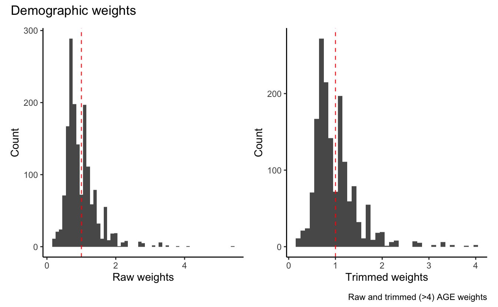
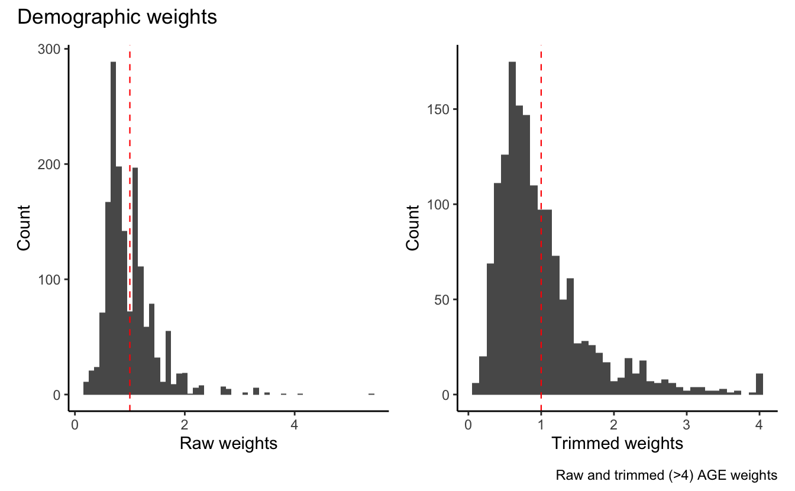

This short post describes the procedure used to calculate the post-stratification weights included in the 2019 Belgian National Electoral Study (BNES) data. Organized by [ISPO](https://soc.kuleuven.be/ceso/ispo), the BNES is a post-election study of the Belgium federal elections. The election study combines traditional politically orientated questions (e.g. voting behaviour, left-right orientations), socio-demographic variables (e.g. occupation, ethnicity, gender) and attitudinal dispositions (e.g. democratic values, anti-immigrant stands). The weights available in the dataset have been computed using the statistical suite R ([R Core Team 2019](#ref-r_core_team_r:_2019)) and the survey package version 4.0 ([Lumley 2020](#ref-lumley_SurveyAnalysisComplex_2020)).

# Post-stratification weights

The 2019 BNES is designed to comprise a representative sample of the Belgian electorate. The target population of the BNES consists of all Belgian residents older than 18, eligible to vote for the 2019 Federal Election. Despite the effort to obtain a sample that closely resembles the target population, some groups of people are easier to interview than others. This phenomenon is well known in survey research and is related to two different types of "biases" or "errors." The first one is called "sampling error" and refers to the fact that some groups of people are more difficult to reach than others. The second one is referred as "non-response bias" or the tendency of some groups of people to be less likely to agree to be interviewed than others.

To mitigate the potential mismatch between the BNES sample and the target population, we computed post-stratification weights. These weights are employed to give more or less importance ("weight") to those individuals that have been more or less difficult to reach or interview than others. For instance, if the Belgian electorate consists of 50% females and 50% males, but the sample consists of 40% females and 60% males, we can use a weight that makes the male observations in our sample count less and the female observations count more.

Different methods can be used to generate weights (for an overview see, [Pew Research 2018](#ref-pewresearch_HowDifferentWeighting_2018)). The method generally used at ISPO is a population-based method, in which information on population subclasses is used to calculate weighting coefficients. The main reason to employ such type of post-stratification weights is that our variables of interest (e.g. anti-immigration attitudes) are likely to vary as a function of a set of individual-level characteristics such as education, age, or the different geographical areas in the country.

Post-stratification weights should be ideally calculated using census data. However, Belgium conducted the last census in 2011. Using such data to compute the weights is not appropriate since we would match our sample to the 2011 Belgian population. As commonly done, we use population data from the European Union Labour Force Survey (LFS). The LFS data have been provided by Ellen Quintelier (thanks!) of Statbel, the "Direction Générale Statistique" of Belgium.

# Weights in the BNES 2019 data

The BNES data include six variables for weighting:

1.  **w_age_bel:** weighting coefficients (w) for the joint distribution of age (a), gender (g) and education (e) for the Belgian sample (bel).
2.  **w_age_wal:** weighting coefficients (w) for the joint distribution of age (a), gender (g) and education (e) for the Walloon sample (wal). Brussels respondents are included in the calculation of the w_age_wal weights.
3.  **w_age_vla:** weighting coefficients (w) for the joint distribution of age (a), gender (g) and education (e) for the Flemish sample (vla).
4.  **w_agev_bel:** weighting coefficients (w) for the joint distribution of age (a), gender (g), education (e) and voting behaviour (v) for the Belgian sample (bel).
5.  **w_agev_wal:** weighting coefficients (w) for the joint distribution of age (a), gender (g), education (e) and voting behaviour (v) for the Walloon sample (wal). Since respondents from the Brussels-capital region can vote for both Flemish and Walloon parties, they have been excluded from the w_agev_wal weights calculations (set as missings).
6.  **w_agev_vla:** weighting coefficients (w) for the joint distribution of age (a), gender (g), education (e) and voting behaviour (v) for the Flemish sample (vla).

In this post, I focus on the calculation of w_age_bel and w_agev_bel. The calculations for the Wallonia and Flanders samples are just a matter of subsetting the data according to the corresponding regions.

# Demographics weights

The first step to calculate post-stratification weights is to pre-process the BNES and the LFS data set. Specifically, we need to manipulate our survey data so that the R survey package can automatically match the BNES age, sex, education, region contingency table with the population frequencies from the LFS data set.

<pre class='chroma'><code class='language-r' data-lang='r'>## Read the LSF data ##
lsf &lt;- readxl::<a href='https://readxl.tidyverse.org/reference/read_excel.html'>read_excel</a>("kub_BNES_2019.xlsx",
                          sheet=1)
<a href='https://rdrr.io/r/base/table.html'>table</a>(lsf$REG1)

BXL VLA WAL 
 42  42  42 
<a href='https://rdrr.io/r/base/table.html'>table</a>(lsf$sex1)

MEN WOM 
 63  63 
<a href='https://rdrr.io/r/base/table.html'>table</a>(lsf$age18)

18-27 28-37 38-47 48-57 58-67 68-77    78 
   18    18    18    18    18    18    18 
<a href='https://rdrr.io/r/base/table.html'>table</a>(lsf$educat3c)

 1  2  3 
42 42 42 </code></pre>

The LFS data set is aggregated by specific categories. For instance, education (educat3c) has 3 categories corresponding to low, medium, and high level of education. These correspond to ISCED education codes used in the BNES survey to measure respondents' educational level. However, in the BNES, the education variable has 10 categories. The category from 1 to 5 corresponds to low level of education (ISCED 0, 1, 2), 6 to 8 corresponds to medium level of education (ISCED 3, 4), and 9 to 10 corresponds to high level of education (ISCED 5, 6, 7, 8). Thus, we need to recode the education variable in the BNES data set to match the one in the LFS. In addition, to match the structure of the LFS dataset, aggregating some categories allows us to reduce the number of cells with only a few respondents. This introduces a small bias in the weights but greatly helps to reduce instabilities and the standard errors of the (regression) estimates.

<pre class='chroma'><code class='language-r' data-lang='r'>## Read the BNES data ##
BNES_2019 &lt;- haven::<a href='https://haven.tidyverse.org/reference/read_spss.html'>read_sav</a>("BNES_2019_complete_update_02_10_2021.sav")

BNES_selected &lt;- BNES_2019 %&gt;% select(age,
                                      PROVINCE,
                                      region,
                                      q13,       # education 
                                      q2,        # gender 
                                      addressID, # respondent's ID 
                                      q24        # self-reported vote
                                      )

# recode education to match the LSF data
BNES_selected$educat3c &lt;- <a href='https://rdrr.io/r/base/ifelse.html'>ifelse</a>(BNES_selected$q13 &lt;=5 , 1,
                                  <a href='https://rdrr.io/r/base/ifelse.html'>ifelse</a>(BNES_selected$q13 &gt;5 &amp; BNES_selected$q13 &lt;=8 , 2,
                                    <a href='https://rdrr.io/r/base/ifelse.html'>ifelse</a>(BNES_selected$q13 &gt;8 &amp; BNES_selected$q13 &lt;=10, 3, NA
                                         )))
</code></pre>

Similarly, we need to recode the rest of the variables that we are going to use to calculate the weights, namely age, gender, and region. Age is aggregated in 7 categories: 18-27; 28-37; 38-47; 48-57; 58-67; 68-77 and plus 78. The 3 regions are Flanders (VLA), Wallonia (WAL) and Brussels-capital (BXL). The assigned sex at birth is female (WOM) and male (MEN).

<pre class='chroma'><code class='language-r' data-lang='r'># recode age to match the LSF data
BNES_selected$age18 &lt;- <a href='https://rdrr.io/r/base/ifelse.html'>ifelse</a>(BNES_selected$age &gt;=18 &amp; BNES_selected$age &lt;=27, "18-27", 
                        <a href='https://rdrr.io/r/base/ifelse.html'>ifelse</a>(BNES_selected$age &gt; 27 &amp; BNES_selected$age &lt;=37, "28-37",
                          <a href='https://rdrr.io/r/base/ifelse.html'>ifelse</a>(BNES_selected$age &gt; 37 &amp; BNES_selected$age &lt;=47, "38-47",
                            <a href='https://rdrr.io/r/base/ifelse.html'>ifelse</a>(BNES_selected$age &gt; 47 &amp; BNES_selected$age &lt;=57, "48-57",
                              <a href='https://rdrr.io/r/base/ifelse.html'>ifelse</a>(BNES_selected$age &gt; 57 &amp; BNES_selected$age &lt;=67, "58-67",
                                <a href='https://rdrr.io/r/base/ifelse.html'>ifelse</a>(BNES_selected$age &gt; 67 &amp; BNES_selected$age &lt;=77, "68-77",
                                  <a href='https://rdrr.io/r/base/ifelse.html'>ifelse</a>(BNES_selected$age &gt; 77, "78",NA
                          )))))))

# recode region to match the LSF data
BNES_selected$REG1 &lt;- <a href='https://rdrr.io/r/base/ifelse.html'>ifelse</a>(BNES_selected$region==1, "VLA",
                             <a href='https://rdrr.io/r/base/ifelse.html'>ifelse</a>(BNES_selected$region==2, "WAL",NA
                             ))

# in the original dataset, Brussels-capital region is not present so we are going 
# to use the province variable to identify Brussels's respondents 
BNES_selected$REG1 &lt;-  <a href='https://rdrr.io/r/base/ifelse.html'>ifelse</a>(BNES_selected$REG1=="WAL" &amp; BNES_selected$PROVINCE==2, "BXL", BNES_selected$REG1)

# recode sex to match the LSF data
BNES_selected$sex1 &lt;- <a href='https://rdrr.io/r/base/ifelse.html'>ifelse</a>(BNES_selected$q2==1, "MEN", "WOM")

</code></pre>

Next, we need to exclude those respondents who have missing values on one of the variables that we are going to use to compute the weights. In other words, the BNES contingency table of age, gender, education, and region should be without any empty cell. If you have a high number of missings on one of the matching variables, you can impute the missing values using the r package `Amelia`. If you do not have solid reasons to impute the missing observations, I would not recommend it.

<pre class='chroma'><code class='language-r' data-lang='r'># remove self-reported vote choice. we need this later.
BNES_selected_ager &lt;- BNES_selected %&gt;% select(-q24)
# row-wise NAs deletion 
data_wo_na &lt;- BNES_selected_ager[(!<a href='https://rdrr.io/r/base/NA.html'>is.na</a>(BNES_selected_ager$educat3c) &amp; !<a href='https://rdrr.io/r/base/NA.html'>is.na</a>(BNES_selected_ager$REG1) &amp; !<a href='https://rdrr.io/r/base/NA.html'>is.na</a>(BNES_selected_ager$age18) &amp; !<a href='https://rdrr.io/r/base/NA.html'>is.na</a>(BNES_selected_ager$sex1)), ]
# select only the columns that we need 
data_wo_na &lt;-  data_wo_na %&gt;% select(addressID, sex1, age18, REG1, educat3c)
# transform our variable to factors to feed the survey package
data_wo_na_f &lt;-  data_wo_na %&gt;% mutate_at(vars(sex1,age18,REG1,educat3c),factor)</code></pre>

The next step consists of calculating the population margins and the corresponding expected frequencies. The population expected frequencies tell us how the marginal distribution of the different groups in the sample would look like if the sample resembled the population. Hence, we need to multiply the population margins by the total number of observations in the BNES data.

<pre class='chroma'><code class='language-r' data-lang='r'># calculate the population totals
totals &lt;- lsf %&gt;% 
  group_by(sex1, REG1, age18, educat3c) %&gt;% 
  summarize(count = <a href='https://rdrr.io/r/base/sum.html'>sum</a>(CW_ALL_Q_Sum))

# calculate the expected frequency proportionally to the total number of observations in the BNES data.
marignals_share &lt;- totals %&gt;% 
  ungroup() %&gt;% 
  mutate(marignals_share = count / <a href='https://rdrr.io/r/base/sum.html'>sum</a>(count)) %&gt;% 
  mutate(Freq=marignals_share * <a href='https://rdrr.io/r/base/nrow.html'>nrow</a>(data_wo_na_f))

kable(<a href='https://rdrr.io/r/utils/head.html'>head</a>(marignals_share))
</code></pre>

| sex1 | REG1 | age18 | educat3c |    count | marignals_share |     Freq |
|:-----|:-----|:------|---------:|---------:|----------------:|---------:|
| MEN  | BXL  | 18-27 |        1 | 24656.65 |       0.0027365 | 4.446835 |
| MEN  | BXL  | 18-27 |        2 | 36213.56 |       0.0040192 | 6.531126 |
| MEN  | BXL  | 18-27 |        3 | 16971.64 |       0.0018836 | 3.060841 |
| MEN  | BXL  | 28-37 |        1 | 21671.59 |       0.0024052 | 3.908479 |
| MEN  | BXL  | 28-37 |        2 | 22445.38 |       0.0024911 | 4.048031 |
| MEN  | BXL  | 28-37 |        3 | 55279.43 |       0.0061352 | 9.969663 |

The count table shows how many observations we would have had in each group if the relative frequencies of these groups in the BNES data are the same as those observed in the population.

The next step is to run `postStratify()` to calculate the weights. The function calculates weighting coefficients so that the sample group sizes are as they would be in a stratified sample. In other words, it matches the relative frequencies of the BNES data set with the one observed in the LFS data set.

The `postStratify()` function requires:

1.  a svydesign object with the survey design info such as the respondent id (rid) (rid is mandatory)
2.  same data structure between the sample data set and population data set
3.  a column named Freq for the population margins

<pre class='chroma'><code class='language-r' data-lang='r'>## 1. svydesign object. In this case, we specify only the respondent unique identifier
data_unweighted &lt;- svydesign(ids=~addressID, data=data_wo_na_f)
## 2. drop any unused factor level
marignals_share_f &lt;- marignals_share %&gt;% 
  mutate_at(vars(sex1, REG1, age18, educat3c), factor)
## 3. keep only the population margins (called Freq)
freq_b &lt;- marignals_share %&gt;% 
  select(-marignals_share, -count) 

## Post stratification AGE ##
ps &lt;- postStratify(design = data_unweighted,                 # svydesign object
                   strata = ~sex1 + age18 + educat3c + REG1, # variables for the post stratification 
                   population = freq_b,                      # population margins
                   partial = TRUE)                           # ignore strata not present in the sample  

## extract the weights to plot later
non_trimmed_w_df &lt;- <a href='https://rdrr.io/r/base/data.frame.html'>data.frame</a>("raw_weights" = <a href='https://rdrr.io/r/stats/weights.html'>weights</a>(ps))</code></pre>

In certain scenarios, the computed weights might be too large. This happens when the sample margins are very different compared to the population margins. For instance, if our sample contains only 1 female respondent aged between 18 and 25 with university education but our target population is Belgian university students, the weight assigned to this respondent would be extremely large. Fortunately, we can trim the weights to avoid to have observations that are much larger than others. This introduces a small bias in the weights coefficients but greatly reduce standard errors ([Kish 1992](#ref-kish1992weighting)). We followed the [ESS](http://www.europeansocialsurvey.org/docs/methodology/ESS_post_stratification_weights_documentation.pdf) and trimmed the weights at the value of 4.

<pre class='chroma'><code class='language-r' data-lang='r'>## Trimming ##
trimmed_w &lt;- trimWeights(ps, 
                         upper = 4,  
                         strict = T
                         ) 

trimmed_w_df &lt;- <a href='https://rdrr.io/r/base/data.frame.html'>data.frame</a>("trimmed_weights" = <a href='https://rdrr.io/r/stats/weights.html'>weights</a>(trimmed_w))

## Plotting Weights ##
plot_non_trimmed &lt;- ggplot(non_trimmed_w_df, aes(x=raw_weights)) + 
                    geom_histogram(binwidth = 0.1) + 
                    geom_vline(xintercept = 1, 
                           linetype = "dashed", 
                           color = "red", 
                           size = 0.4) + 
                  xlab("Raw weights") +
                  ylab("Count") +
                  theme_classic()

plot_trimmed &lt;- ggplot(trimmed_w_df, aes(x = trimmed_weights)) + 
                geom_histogram(binwidth = 0.1) + 
                geom_vline(xintercept = 1, 
                           linetype = "dashed", 
                           color = "red", 
                           size = 0.4) + 
                  xlab("Trimmed weights") +
                  ylab("Count")  +
                  theme_classic()

plot_non_trimmed + plot_trimmed + plot_annotation(
  title = 'Demographic weights',
  caption = 'Raw and trimmed (&gt;4) AGE weights')

</code></pre>

Finally, we merge the weights with the untouched dataset. We use the respondent id (addressID) to merge the two datasets together. This automatically set the weights to NA for those respondents with missing on the matching variables.

<pre class='chroma'><code class='language-r' data-lang='r'>
## Merge the weights with the BNES data ##
binded &lt;- <a href='https://rdrr.io/r/base/cbind.html'>cbind</a>(data_wo_na_f, <a href='https://rdrr.io/r/stats/weights.html'>weights</a>(trimmed_w))
# rename the weight variable according to the type of weights calculated (i.e. AGE)
<a href='https://rdrr.io/r/base/names.html'>names</a>(binded)[<a href='https://rdrr.io/r/base/grep.html'>grep</a>("weights", <a href='https://rdrr.io/r/base/names.html'>names</a>(binded))] &lt;- "w_age_bel"
# select the weights and the rid 
binded_selected &lt;- binded %&gt;% 
  select(w_age_bel, addressID) 

# merge the weight variable into the original dataset using the respondent ID
# this allows us to assign an NA for those obs for which we did not compute a weight 
BNES_2019 &lt;- left_join(BNES_2019,       # original dataset 
                       binded_selected, # weights and the rid 
                       by = "addressID" # merging by rid 
                       )

## Check everything is in order ##
# missing weights only for obs with missing on the matching variables
id_na &lt;- BNES_2019[ ,"addressID"][<a href='https://rdrr.io/r/base/NA.html'>is.na</a>(BNES_2019[<a href='https://rdrr.io/r/base/c.html'>c</a>("w_age_bel")])]

list_na &lt;- <a href='https://rdrr.io/r/base/c.html'>c</a>()
for (i in <a href='https://rdrr.io/r/base/array.html'>array</a>(<a href='https://rdrr.io/r/base/unlist.html'>unlist</a>(id_na))) &#123;
list_na[[<a href='https://rdrr.io/r/base/character.html'>as.character</a>(i)]] &lt;- <a href='https://rdrr.io/r/base/unlist.html'>unlist</a>(BNES_selected[BNES_selected$addressID==i, ])
&#125;

kable(<a href='https://rdrr.io/r/utils/head.html'>head</a>(<a href='https://rdrr.io/r/base/data.frame.html'>data.frame</a>(purrr::<a href='https://purrr.tidyverse.org/reference/reduce.html'>reduce</a>(list_na, rbind)), 5))
</code></pre>

|       | age | PROVINCE | region | q13 | q2  | addressID | q24 | educat3c | age18 | REG1 | sex1 |
|:------|:----|:---------|:-------|:----|:----|:----------|:----|:---------|:------|:-----|:-----|
| out   | NA  | 7        | 2      | 4   | 2   | 43905     | 12  | 1        | NA    | WAL  | WOM  |
| elt   | NA  | 2        | 2      | 4   | 2   | 43409     | 52  | 1        | NA    | BXL  | WOM  |
| elt.1 | NA  | 2        | 2      | 3   | 1   | 43119     | 12  | 1        | NA    | BXL  | MEN  |
| elt.2 | NA  | 2        | 2      | 3   | 2   | 41111     | 13  | 1        | NA    | BXL  | WOM  |
| elt.3 | NA  | 2        | 2      | 4   | 2   | 41103     | 77  | 1        | NA    | BXL  | WOM  |

# Voting behaviour weights

Similarly to the tendency of some individual to be less likely to participate in the survey, voters, non-voters, and voters of certain parties might be more or less likely to take part in the survey itself. To account for imbalance in turnout and in levels of party support, we can calculate post-stratification weights that take into account the 2019 election results and matches the self-reported vote in the BNES survey. This type of weights combines demographic information and the correct distribution of the vote share of each political parties at Election Day.

The procedure to calculate voting behaviour weights is a bit more complicated compared to the previous one. For the demographic weights, we used the joint distribution of the demographic variables. This means that we have the LFS estimated number of males living in Wallonia, aged between 18-28, with a high level of education. For voting behaviour, we do not have a complete cross-classification for the grouping variables. We only know the marginal distribution, that is, the total number of people who voted for a certain party, who cast a blanc or null vote, and who did not vote. In other words, we do not know the number of males living in Wallonia, aged between 18-28, with a high level of education who voted for the Socialist Party or cast a null vote. As such, we need to use a technique called raking.

Given two different contingency tables, raking searches for the values to assign to the cells of the first table such that its marginal counts (the row and column "totals") are the same as in the second table. For example, we know from the population data that our sample should be 48% male and 52% female with 80% of turnout during the election day. The raking procedure will first adjust the weights so that the gender ratio in the survey matches the desired population distribution. Next, the weights are adjusted so that the voters and non-voters marginal distribution in the survey matches the population figures. If the adjustment for voting makes the sex distribution out of alignment, the weights are adjusted till all of the post-stratification variables match their specified targets. That's why this procedure is called raking. The name refers to the process of "raking" a garden bed alternately in each direction to smooth out the soil.

In addition to the LFS data, we gather the official 2019 electoral results and derived the vote share of each political parties at Election Day, the share of null and blank votes, and the share of non-voters. We acquired the 2019 electoral results from the website of the [Federal Public Services Home Affairs](https://elections2019.belgium.be/en). The vote share at the Election Day of the following political parties have been included in the weights calculations: CDV, NVA, Open VLD, s.pa, VB, Groen only for Flanders; PVDA/PTB for both Flanders and Wallonia; PS, MR, CDH, Ecolo, DEFI, PP only for Wallonia. Any other party (i.e. francophone party voted in Flanders) have been excluded from the calculations since not present in the BNES data.

<pre class='chroma'><code class='language-r' data-lang='r'>## recode self-reported voting ##
# 50=blank and null votes 
# 97=other party
# PTB and PVDA are counted separately in the federal results but it is a single party
# 99=NAs 

BNES_selected$vote &lt;- <a href='https://rdrr.io/r/base/ifelse.html'>ifelse</a>(BNES_selected$q24 == 8, 97,                                    # francophone party
                        <a href='https://rdrr.io/r/base/ifelse.html'>ifelse</a>(BNES_selected$q24 == 9|BNES_selected$q24==19, 97,            # other party 
                          <a href='https://rdrr.io/r/base/ifelse.html'>ifelse</a>(BNES_selected$q24 == 16, 7,                                # merge PTB and PVDA 
                            <a href='https://rdrr.io/r/base/ifelse.html'>ifelse</a>(BNES_selected$q24 == 77 | BNES_selected$q24 ==99, NA,    # 77 DK 99 No response
                              <a href='https://rdrr.io/r/base/ifelse.html'>ifelse</a>(BNES_selected$q24 == 50 | BNES_selected$q24 == 51, 50, # merge blank and null votes 
                                 BNES_selected$q24
                        )))))

# remove missings 
data_wo_na &lt;- BNES_selected[(!<a href='https://rdrr.io/r/base/NA.html'>is.na</a>(BNES_selected$educat3c) &amp; !<a href='https://rdrr.io/r/base/NA.html'>is.na</a>(BNES_selected$REG1) &amp; !<a href='https://rdrr.io/r/base/NA.html'>is.na</a>(BNES_selected$age18) &amp; !<a href='https://rdrr.io/r/base/NA.html'>is.na</a>(BNES_selected$sex1) &amp; !<a href='https://rdrr.io/r/base/NA.html'>is.na</a>(BNES_selected$vote)), ]
# factorize 
data_wo_na_f &lt;-  data_wo_na %&gt;% 
                 select(addressID, sex1, age18, REG1, educat3c, vote) %&gt;%
                 mutate_at(vars(sex1, age18, REG1, educat3c, vote), factor)

## recode official election results to match the coding using in the sample ##
results_federal &lt;- readr::<a href='https://readr.tidyverse.org/reference/read_delim.html'>read_csv</a>("2019_results_federal.csv")

results_federal$party  &lt;- <a href='https://rdrr.io/r/base/c.html'>c</a>(
  15, # ecolo
  3,  # open vld
  14, # cdh
  13, # mr
  18, # pp
  2,  # NVA
  5,  # VB
  1,  # C&amp;V
  17, # defi
  7,  # pvda
  97, # other party 
  6,  # groen
  4,  # spa
  12, # PS
  <a href='https://rdrr.io/r/base/rep.html'>rep</a>(97, <a href='https://rdrr.io/r/base/length.html'>length</a>(15:32)), # other party 
  50, # invalid 
  52  # absentee 
  )

</code></pre>

The next step consists of calculating the population margins and the corresponding expected frequencies for both the joint distribution of age, gender, education, and region and for the voting. Let's start with the voting frequencies.

<pre class='chroma'><code class='language-r' data-lang='r'>## frequencies voting ##
totals &lt;- results_federal %&gt;% 
          group_by(party) %&gt;% 
          summarize(count = <a href='https://rdrr.io/r/base/sum.html'>sum</a>(votes))

marignals_share &lt;- totals %&gt;% 
                   ungroup() %&gt;% 
                   mutate(marignals_share = count / <a href='https://rdrr.io/r/base/sum.html'>sum</a>(count)) %&gt;% 
                   mutate(Freq = marignals_share * <a href='https://rdrr.io/r/base/nrow.html'>nrow</a>(data_wo_na_f))

# factorise and rename to feed the rake() function  
freq_voting &lt;- marignals_share %&gt;% 
               mutate_at(vars(party), factor) %&gt;%
               select(-marignals_share, -count)

<a href='https://rdrr.io/r/base/names.html'>names</a>(freq_voting)[1] &lt;- "vote" 

kable(<a href='https://rdrr.io/r/utils/head.html'>head</a>(freq_voting))
</code></pre>

| vote |      Freq |
|:-----|----------:|
| 1    | 113.67733 |
| 2    | 205.04388 |
| 3    | 109.30283 |
| 4    |  85.85117 |
| 5    | 152.85593 |
| 6    |  78.07835 |

Next, we need to calculate the frequencies of sex age education taking into account the geographical location of the respondent (region). One issue has been glossed so far. If we are unlucky enough to sample no one from a certain population stratum, it is not possible to calculate the weights. One of the major difference between the procedure to calculate the demographic and the voting behaviour weights is the handling of such empty strata. When the option `partial = TRUE` , `postStatify()` automatically ignores any empty cell in the computation of the weights. The `rake()` function does include a `partial = TRUE` option. We could aggregate the data such as we have fewer but larger groups. Since we have just a few missing strata and only for the Brussel region, we are going to manually remove these empty cells.

<pre class='chroma'><code class='language-r' data-lang='r'>## frequencies gender reg age eduction ##
totals &lt;- lsf %&gt;% group_by(sex1, REG1, age18, educat3c) %&gt;% 
          summarize(count = <a href='https://rdrr.io/r/base/sum.html'>sum</a>(CW_ALL_Q_Sum))

# we can check the presence of any empty strata (0) in our survey data using xtab
# sum(xtabs(~sex1 + REG1 + age18 + educat3c,
#      data_wo_na_f)==0)

# remove empty cells for rake
totals &lt;- totals[!<a href='https://rdrr.io/r/base/c.html'>c</a>(totals$educat3c == 1 &amp; totals$REG1 == "BXL" &amp; totals$sex1== "MEN" &amp; totals$age18=="68-77"),  ]
totals &lt;- totals[!<a href='https://rdrr.io/r/base/c.html'>c</a>(totals$educat3c == 1 &amp; totals$REG1 == "BXL" &amp; totals$sex1== "MEN" &amp; totals$age18== "78"),    ]
totals &lt;- totals[!<a href='https://rdrr.io/r/base/c.html'>c</a>(totals$educat3c == 1 &amp; totals$REG1 == "BXL" &amp; totals$sex1== "WOM" &amp; totals$age18== "18-27"), ]
totals &lt;- totals[!<a href='https://rdrr.io/r/base/c.html'>c</a>(totals$educat3c == 1 &amp; totals$REG1 == "BXL" &amp; totals$sex1== "WOM" &amp; totals$age18== "58-67"), ]
totals &lt;- totals[!<a href='https://rdrr.io/r/base/c.html'>c</a>(totals$educat3c == 1 &amp; totals$REG1 == "BXL" &amp; totals$sex1== "WOM" &amp; totals$age18== "78"),    ]
totals &lt;- totals[!<a href='https://rdrr.io/r/base/c.html'>c</a>(totals$educat3c == 2 &amp; totals$REG1 == "BXL" &amp; totals$sex1== "MEN" &amp; totals$age18== "58-67"), ]
totals &lt;- totals[!<a href='https://rdrr.io/r/base/c.html'>c</a>(totals$educat3c == 2 &amp; totals$REG1 == "BXL" &amp; totals$sex1== "MEN" &amp; totals$age18== "68-77"), ]

marignals_share &lt;- totals %&gt;% 
                   ungroup() %&gt;% 
                   mutate(marignals_share = count / <a href='https://rdrr.io/r/base/sum.html'>sum</a>(count)) %&gt;% 
                   mutate(Freq = marignals_share * <a href='https://rdrr.io/r/base/nrow.html'>nrow</a>(data_wo_na_f))

# factorise and rename to feed the rake() function  
marignals_share_f &lt;- marignals_share %&gt;% 
                     mutate_at(vars(sex1, REG1, age18, educat3c), factor)

freq_ager &lt;- marignals_share %&gt;% 
             select(-marignals_share, -count) 

kable(<a href='https://rdrr.io/r/utils/head.html'>head</a>(freq_ager))
</code></pre>

| sex1 | REG1 | age18 | educat3c |     Freq |
|:-----|:-----|:------|---------:|---------:|
| MEN  | BXL  | 18-27 |        1 | 4.262968 |
| MEN  | BXL  | 18-27 |        2 | 6.261078 |
| MEN  | BXL  | 18-27 |        3 | 2.934282 |
| MEN  | BXL  | 28-37 |        1 | 3.746872 |
| MEN  | BXL  | 28-37 |        2 | 3.880654 |
| MEN  | BXL  | 28-37 |        3 | 9.557439 |

Finally, we are going to use the `rake()` function to iteratively match the population margins with the sample margins.

<pre class='chroma'><code class='language-r' data-lang='r'>data_unweighted &lt;- svydesign(ids=~addressID, data=data_wo_na_f)

## Run raking (IPF) for ager and voting ##
s_rake &lt;- rake(design = data_unweighted, 
                        sample.margins = <a href='https://rdrr.io/r/base/list.html'>list</a>(~sex1 + age18 + educat3c + REG1, ~vote), 
                        population.margins = <a href='https://rdrr.io/r/base/list.html'>list</a>(freq_ager, freq_voting)
                     )

non_trimmed_wv_df &lt;- <a href='https://rdrr.io/r/base/data.frame.html'>data.frame</a>("raw_weights" = <a href='https://rdrr.io/r/stats/weights.html'>weights</a>(s_rake))

## Trimming ##
trimmed_w &lt;- trimWeights(s_rake, 
                         upper = 4,
                         strict = T) 

trimmed_wv_df &lt;- <a href='https://rdrr.io/r/base/data.frame.html'>data.frame</a>("trimmed_weights" = <a href='https://rdrr.io/r/stats/weights.html'>weights</a>(trimmed_w))

# Plotting ##
plot_non_trimmed_v &lt;- ggplot(non_trimmed_w_df, aes(x=raw_weights)) + 
                      geom_histogram(binwidth = 0.1) + 
                      geom_vline(xintercept = 1, 
                               linetype = "dashed", 
                               color = "red", 
                               size = 0.4) + 
                    xlab("Raw weights") +
                    ylab("Count")  +
                    theme_classic()

plot_trimmed_v &lt;- ggplot(trimmed_wv_df, aes(x = trimmed_weights)) + 
                  geom_histogram(binwidth = 0.1) + 
                  geom_vline(xintercept = 1, 
                           linetype = "dashed", 
                           color = "red", 
                           size = 0.4) + 
                    xlab("Trimmed weights") +
                    ylab("Count")  +
                    theme_classic()

(plot_non_trimmed_v + plot_trimmed_v) + plot_annotation(
  title = 'Demographic weights',
  caption = 'Raw and trimmed (&gt;4) AGE weights')

</code></pre>

Let's merge the weights with the BNES dataset and check that we achieved the desired outcome.

<pre class='chroma'><code class='language-r' data-lang='r'>
## check everything is in order ##
# calculate vote share population
marignals_vote &lt;- results_federal %&gt;% group_by(party) %&gt;% 
                                      summarize(count = <a href='https://rdrr.io/r/base/sum.html'>sum</a>(votes)) 

freq_vote_pop &lt;- marignals_vote %&gt;% 
                 ungroup() %&gt;% 
                 mutate(Freq = count/<a href='https://rdrr.io/r/base/sum.html'>sum</a>(count))

# check vote choice is the same across sample and population 
kable(<a href='https://rdrr.io/r/base/cbind.html'>cbind</a>(svymean(~vote, s_rake),freq_vote_pop$Freq))
</code></pre>

|        |           |           |
|:-------|----------:|----------:|
| vote1  | 0.0737685 | 0.0737685 |
| vote2  | 0.1330590 | 0.1330590 |
| vote3  | 0.0709298 | 0.0709298 |
| vote4  | 0.0557113 | 0.0557113 |
| vote5  | 0.0991927 | 0.0991927 |
| vote6  | 0.0506673 | 0.0506673 |
| vote7  | 0.0715771 | 0.0715771 |
| vote12 | 0.0785561 | 0.0785561 |
| vote13 | 0.0627869 | 0.0627869 |
| vote14 | 0.0307138 | 0.0307138 |
| vote15 | 0.0509876 | 0.0509876 |
| vote17 | 0.0184132 | 0.0184132 |
| vote18 | 0.0091943 | 0.0091943 |
| vote50 | 0.0536374 | 0.0536374 |
| vote52 | 0.1161986 | 0.1161986 |
| vote97 | 0.0246064 | 0.0246064 |

<pre class='chroma'><code class='language-r' data-lang='r'>
## Merging with BNES data set ##
binded &lt;- <a href='https://rdrr.io/r/base/cbind.html'>cbind</a>(data_wo_na_f,<a href='https://rdrr.io/r/stats/weights.html'>weights</a>(trimmed_w))
<a href='https://rdrr.io/r/base/names.html'>names</a>(binded)[<a href='https://rdrr.io/r/base/grep.html'>grep</a>("weights",<a href='https://rdrr.io/r/base/names.html'>names</a>(binded))] &lt;- "w_agev_bel"
binded %&gt;% select(w_agev_bel,addressID) -&gt; binded_selected
BNES_2019 &lt;- left_join(BNES_2019, binded_selected, by = "addressID")</code></pre>

# Unweighted and weighted cross-tables

## Cross-table w_age_bel

## Cross-table w_agev_bel

# R session information

<pre class='chroma'><code class='language-r' data-lang='r'>R version 4.0.3 (2020-10-10)
Platform: x86_64-apple-darwin17.0 (64-bit)
Running under: macOS Big Sur 10.16

Matrix products: default
BLAS:   /Library/Frameworks/R.framework/Versions/4.0/Resources/lib/libRblas.dylib
LAPACK: /Library/Frameworks/R.framework/Versions/4.0/Resources/lib/libRlapack.dylib

locale:
[1] en_US.UTF-8/en_US.UTF-8/en_US.UTF-8/C/en_US.UTF-8/en_US.UTF-8

attached base packages:
[1] grid      stats     graphics  grDevices utils     datasets  methods   base     

other attached packages:
 [1] knitr_1.31           patchwork_1.1.1      gtsummary_1.3.6.9015 gt_0.2.2             survey_4.0           survival_3.2-7       Matrix_1.2-18        forcats_0.5.1        stringr_1.4.0        dplyr_1.0.4          purrr_0.3.4          readr_1.4.0          tidyr_1.1.2          tibble_3.0.6        
[15] ggplot2_3.3.3        tidyverse_1.3.0     

loaded via a namespace (and not attached):
 [1] httr_1.4.2          jsonlite_1.7.2      splines_4.0.3       modelr_0.1.8        assertthat_0.2.1    highr_0.8           cellranger_1.1.0    yaml_2.2.1          gdtools_0.2.3       pillar_1.4.7        backports_1.2.1     lattice_0.20-41     glue_1.4.2          uuid_0.1-4         
[15] digest_0.6.27       rvest_0.3.6         colorspace_2.0-0    htmltools_0.5.1.1   pkgconfig_2.0.3     broom_0.7.5         haven_2.3.1         scales_1.1.1        webshot_0.5.2       processx_3.4.5      officer_0.3.16      downlit_0.2.1       generics_0.1.0      farver_2.0.3       
[29] ellipsis_0.3.1      withr_2.4.1         cli_2.3.0           magrittr_2.0.1      crayon_1.4.1        readxl_1.3.1        evaluate_0.14       ps_1.5.0            fs_1.5.0            fansi_0.4.2         broom.helpers_1.2.0 xml2_1.3.2          tools_4.0.3         data.table_1.13.6  
[43] hms_1.0.0           mitools_2.4         lifecycle_1.0.0     flextable_0.6.3     munsell_0.5.0       reprex_0.3.0        zip_2.1.1           callr_3.5.1         compiler_4.0.3      systemfonts_0.3.2   rlang_0.4.10        rstudioapi_0.13     base64enc_0.1-3     labeling_0.4.2     
[57] rmarkdown_2.7       gtable_0.3.0        DBI_1.1.1           R6_2.5.0            lubridate_1.7.9.2   stringi_1.5.3       hugodown_0.0.0.9000 Rcpp_1.0.6          vctrs_0.3.6         dbplyr_2.0.0        tidyselect_1.1.0    xfun_0.21          </code></pre>

# References

Kish, Leslie. 1992. "Weighting for Unequal Pi."

Lumley, Thomas. 2020. "Survey: Analysis of Complex Survey Samples."

Pew Research. 2018. "How Different Weighting Methods Work." *Pew Research Center Methods*.

R Core Team. 2019. "R: A Language and Environment for Statistical Computing." Vienna, Austria: R Foundation for Statistical Computing.

[^1]: [Alberto Stefanelli](https://albertostefanelli.com/)

